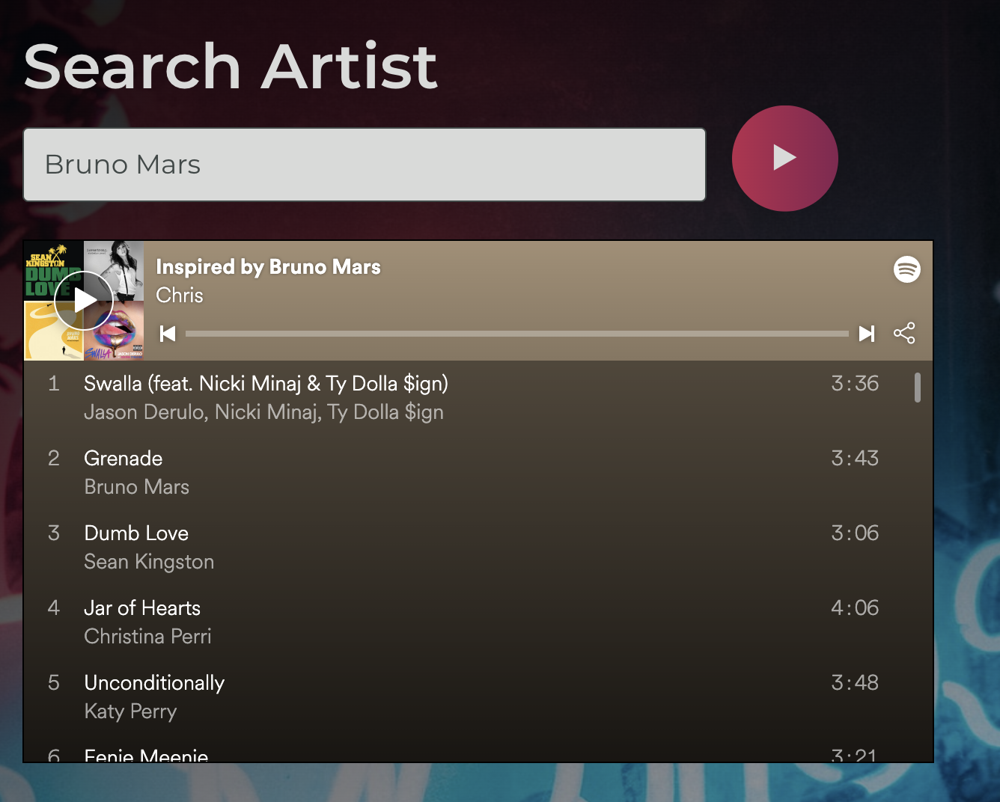

# Make-A-Playlist!
Make a Spotify Playlist and send the list to your phone! Built with React, Flask, SpotifyAPI, &amp; TwilioAPI.

See all the playlist that have been created [here!](https://open.spotify.com/user/s0rxn0lrvbtx9div9v2zun024)

UI inspired by [Music Landing Page](https://dribbble.com/shots/5686734-Music-Landing-page)

[Live Link](https://make-a-playlist.netlify.app/)

[API Link](https://api-make-a-playlist.herokuapp.com/)


## Technologies

- React
- Flask
- [Twilio API](https://www.twilio.com/docs/usage/api)
- [Spotify API](https://developer.spotify.com/documentation/web-api/)
- [Spotipy (Python Wrapper)](https://spotipy.readthedocs.io/en/2.12.0/)
- [GSAP React Library](https://greensock.com/react/)

## Features

- Create a playlist with related songs by your favorite artist!
- Like the playlist? Enter the number and send the link of the playlist to you phone number!



## Setup

Get Spotify Keys
```
https://developer.spotify.com/documentation/web-api/
```
Get Twilio Number
```
https://www.twilio.com/try-twilio
```
Put keys in
```
# playlist_utils.py

SPOTIPY_CLIENT_ID = "YOUR SPOTIPY_CLIENT_ID HERE"
SPOTIPY_CLIENT_SECRET = "YOUR SPOTIPY_CLIENT_SECRET HERE"
SPOTIPY_REDIRECT_URI = "YOUR SPOPTIPY_REDIRECT_URI HERE"
username = "YOUR USERNAME HERE

# message_utils.py

account_sid = "YOUR TWILIO_ACCOUNT_SID. HERE"
auth_token = "YOUR TWILIO_AUTH_TOKEN HERE"
```

Install all backend dependencies and run backend server 
```
python3 -m venv env
source venv/bin/activate
pip install -r requirements.txt 
python app.py
```
Install Frontend Dependencies and run frontend
```
cd frontend
npm run start
```

